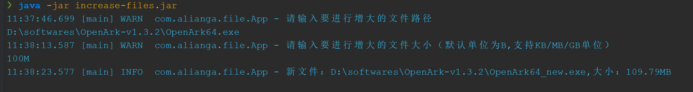

## 文件无损增大
有些需要增大文件的场景，比如：
* 某些网站要求提交的文件必须达到某个大小，而你的文件实际上并没有那么大
* 更换电脑后，将旧电脑处置掉（卖掉/送人/归还/...），只是简单把个人文件（文档、图片、视频、音频等）备份、删除、并清空回收站后
并不能确保文件不被 **文件恢复工具** 恢复

### 使用方式
> * 新生成的文件默认会和你要进行增大处理的文件在同一个目录，并在文件名后面加上 `_increased` 后缀
> * 要增大的文件大小，默认单位为 `B` ，支持的单位为`B`、`KB`、`MB`、`GB`
#### 方式一
将参数信息追加在启动jar包的命令后，
```bash
## java -jar increase-files.jar your_origin_file increase_size
## 例如：将某个图片增大到10M
java -jar increase-files.jar 111.jpg 10MB

```
> `increase_size` 默认单位为 `B` ，支持的单位为`B`、`KB`、`MB`、`GB`

#### 方式二
命令行交互式，直接运行jar包，在命令行控制台中进行交互式对文件进行增大操作
```bash
## 运行jar包
java -jar increase-files.jar
## 输入文件路径
D:\softwares\OpenArk-v1.3.2\OpenArk64.exe
## 输入要增大的大小
100MB
## 程序将自动输出增大后的文件信息

```



### 方式三

直接通过IDE运行

1. 克隆源码
2. 找到 `com.alianga.file.App`类，运行`main`即可

